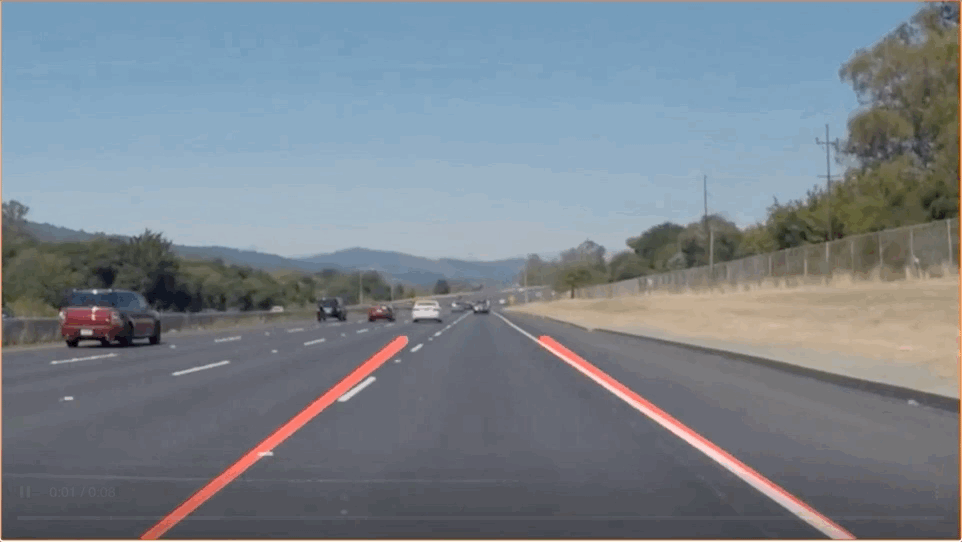

# Detecting-Lane-Lines
This is a small project for detecting lane lines using computer vision.

## Overview
This project explores a simple approach to identifying car lanes from a dashcam video.



While most use sophisticated deep learning algorithms to identify car lanes, as part of the Udacity self-driving car engineer nano degree program, I was able to use simple computer vision alrogithms to detect car lanes from a dashcam video. This process was achieved in 4 steps: <strong>edge detection, ROI bounding box, Hough transform and line interpolation.</strong> Each step is explained in detail below.

## Installation
In order to run my code, you will first have to install all of the dependancies:
```python3
pip install -r requirements.txt
```
I highly recomend using a virtual enviornment.

## Edge Detection
There are many different algorithms in computer vision for detecting edges. For this mini project, I used the Canny edge detection algorithm to first identify edges in a video frame. Essentially this algorithm works by finding the derivative of pixel intensity, and identifies the pixels that have a sharp change in intensity. As a result, to use this algorihtm, I first converted the image into a gray scale image, so that all pixel values lie in the range of 0 - 255 (255 represents white, and 0 represents black). Here is an example of what the output from the Canny edge detection algorithm looks like:


## ROI (Bounding Box)


## Hough Transfrom


## Interpolation

