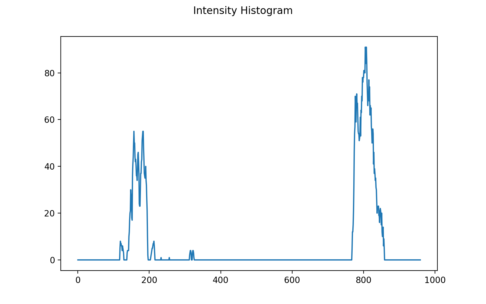

# Detecting Lane Lines
This is a project for detecting lane lines using computer vision (completed as part of Udacity self-driving car engineer nanodegree program).

## Overview
This project explores a simple approach to identifying car lanes from a dashcam video. The first half of this README file contains explanations for detetcting lane lines using a very naiive and simple approach. The second part includes explanations for detetcting lane lines using more advanced computer vision techniques. The code for the first half of this repository is contained in the "lane_finding" folder, whilst the code for the more advanced lane finding algorithm is stored in the "advanced_lane_finding" folder.

<p align="center">
    
    
</p>

## Installation & Run
In order to run my code, you will first have to install all of the dependancies. I highly recomend using a virtual enviornment.
```python3
pip install -r requirements.txt
```
The python file <strong>lane_finding.py</strong> contains code that will allow you to run my algorithm on still images. The output will automatically be saved in the image_output folder. If you have your own video you want to run using my algorithm, then use the jupyter notebook <strong>lane_finding.ipynb</strong> instead. The Jupyter notebook will process all videos in test_video and output the result in video_output.

The folder "advanced_lane_finding" contains all of the code needed to run the advanced lane finding algorithm. The driver file is called <strong>main.py</strong>. By default, the code will process all of the videos saved in "media/test_video" and save the output video files in the folder "../video_output". I purposely did not upload the final video output, so make sure you create an empty folder called "video_output". If you want to change some of the parameters, you can use argument tags as shown in the example below.

```python3
# To run driver code
python main.py

# for undistortion test (only need to run once)
python main.py --undistort_test

# sliding window size of 200, and kernel size of 5
python main.py --window_margin 200 --ksize 5
```

## Simple Lane Finding
Here I will introduced some basic computer vision techniques used for detecting lane lines. Although these algorithms may seem basic, these algorithms are the building blocks for using/creating more robust and advanced computer vision algorithms. All the explanations/code presented here can be found within the "lane_finding" folder.

### Edge Detection
There are many different algorithms in computer vision for detecting edges. For this mini project, I used the Canny edge detection algorithm to first identify edges in a video frame. Essentially this algorithm works by finding the derivative of pixel intensity, and identifies the pixels that have a sharp change in intensity. As a result, to use this algorihtm, I first converted the image into a gray scale image, so that all pixel values lie in the range of 0 - 255 (255 represents white, and 0 represents black). Here is an example of what the output from the Canny edge detection algorithm looks like:


left image: original image. <br/>
middle image: grayscale image (after Gaussian blur). <br/>
right image: Canny edge detection output.

## ROI (Bounding Box)
As you can see from the Canny edge output, we have a lot of edges that we are not interested in. The goal of this project is to find the car lanes, so we are not interested in any edges that do not represent the car lanes. Therefore, we can apply a mask to capture the region of the image that we are interested in. This makes sense as the location of the car lanes will not change from frame to frame. The vertecies corresponding to the bounding box are hard coded. Here is what the ouput looks like after the bounding box has been applied:


left image: original image. <br/>
middle image: Canny edge detection output. <br/>
right image: ROI output.

### Hough Transfrom
We now need to convert these edges to lines, after all, we want to detect lines not edges. The Hough transform is perfect for converting edges into lines. Without getting into too much detail, the Hough transform basically tranforms all edge coordinates in cartesian space to polar coordinates. If you are not familiar with Hough transform, I recommend you check this medium article [here.](https://towardsdatascience.com/lines-detection-with-hough-transform-84020b3b1549) Essentially we have used the output from the Canny edge detection algorithm into lines using the Hough transform.


left image: original image. <br/>
middle image: ROI output. <br/>
right image: Hough transform output.

### Interpolation
The final step is to identify two lines (one for the left lane and another for the right lane) from the Hough transfrom output. In my opinion, this is the part that matters the most, since until now we've just been using "out-of-the-box" algorithms.

As you can see from the Hough transform output, despite the fact we used bounding boxes to limit our view to a region we are interested in, there are still a few lines that dont correspond to the lanes we want to find. As a result, one method to overcome this issue is to identify the gradient of each line and see if the gradient corresponds to a lane. For examples, if the gradient of a line if 10, then we can intuitively assume that that line is not from a lane. Borrowing this logic, we can just ignore all of the lines that we think are not from a lane marking. After collecting all the lines from a lane marking, we can caluclate the mean of the gradient and interept to find appropriate x-values to go with our y-values. Essentially this process will determine two equations (one for left lane, another for right lane) and find the starting and ending point of each line. These 4 points (2 points for each line) can be used to draw a line using any in-built drawing function. The final output of this project is shown below.


left image: original image. <br/>
middle image: lanes detected. <br/>
right image: result.

## Advanced Lane Finding
Here we will delve deeper into image gradient algorithms and more robust methods for detecting lane lines. The code for this section can be found in the "advanced_lane_finding" folder.

### Sobel Filters
In the first section of this project, I went over the Canny edge detection algorithm. I would say that the Canny edge detection algorithm is the industry standard when performing edge detections. However, there are times when you only want to examine the rate of change in intensity along the x or y axis. In other words, there are going to be cases where the gradient along the x-axis or y-axis is wanted individually. This is where the Sobel gradients come in handy. The Sobel filter helps us calculate the gradient along the x-axis and y-axis individually. This is achieved by convolving the image in question with a Sobel filter. The filter size can be any square size greater or equal to 3 (it also has to be an odd number). For the purposes of this project, I have used a 3-by-3 filter. Here are the results from the Sobel filters:


As you can see from the result above, the Sobel X filter identifies edges along the y-axis. In other words, it finds edges that run along the vertical. On the other hand, the Sobel Y filter identifies edges along the x-axis (horizontal lines). For the purpose of identifying lane lines, the Sobel X filter seems to be more useful than the Sobel Y filter, or for that matter the Canny edge detector.

### Gradient Direction
Until now we have explored multiple methods for calculating the intensity of gradients. However, we can also calculate the direction of gradients. This is useful as we can caluculate the angle of our edges detected. In order to achieve this we simple take the magnitude of the gradient at each pixel. Since we can caluclate the corresponding x and y-axis gradients seperately, we can also use this to find the angle. We take the arctan(sobel_y/sobel_x) to find the angle of our gradient. Different parameters can be used to change the threshold capacity. Here are some results from using different angle combinations.


### Camera Calibration
Camera calibration is an important step in computer vision. Images from cameras are never perfect, and always needs to be calibrated before applying any of the algorithms mentioned thus far. The physics behind why cameras need to be calibrated can be found [here.](https://medium.com/analytics-vidhya/camera-calibration-theory-and-implementation-b253dad449fb) (keep in mind this is a lenghtly article). The camera you use for your projects are most defenitely going to be different to the camera I used for this project. Therefore, you should follow this step and calibrate your own camera. We can use opencv's built-in function to find the [R|t] matrix and distortion coefficients. The distortion coefficients are all we need to undistort our images, since we are not yet dealing with space transformations.


### Perspective Projection
Perpective transform essentially allows us to artificially view an image from a different angle. In some luxury cars, when you park the car the car will show you a birds-eye view of the car. This is sometimes called "surround view". This technology is also using perspective transform! As we saw in the simple lane detection pipeline, trying to find edges from the dashcam image directly produced a lot of noise. To combat this, we can actually view the dashcam image, as if we are flying over it. Here is the what the result of perspective transformation looks like.


We can once again use opencv's built-in function to find the matrix M that transforms our image into a birds-eye view image. The trapezoid shown in the middle is our ROI (ROI was introduced in the simple lane detection part too). This is basically the region we want to see from a birds-eye viewpoint. Once we obtain this transformed image, we can apply any well known edge detection algorithm and identify our lane lines! Since our transformed image only contains lane lines, not only will it be easy to identify the lanes, but it will also have much less noise.

### Lane Line Identification
Using our perspective transformed lane lines, we can apply any edge detectection algorithm to obtain a binary thresholded output. Using this output, the first we should do is identify where in our binary output the lanes lines exist. There will always be two lane lines, and since our perspective transform (warped) output contain little noise, its very easy for us humans to understand where the lane lines are. However, computers are not as smart as we are. Therefore, we need a method for telling the computer where the lane lines are. One approach to this problem is by using a histogram analysis to see which columns contains the most "activated" pixels. We are not interested in the rows, since lane lines are vertical and not horizontal.

<p align = "center">
    
</p>

Our histogram shows us that the highest intensity (or the most concentrated) columns are approixmately 180 and 820. This obviously means out left lane is near the 180 column, and the right lane is near the 820 column. Using this, we can start a sliding window algorihtm, where we define a window (box) and slide over the image to idenitfy all of the pixels that have an active intensity. In this case, the active intensiy is 1 since we are working with a grayscale image. The red paint on the right image below shows all of the points obtained from using the sliding window algorihtm. The red points are the points we managed to detect.


However, we cant just end here since we want exactly two lines for our lanes. Right now, because of the noise from the lanes, it looks as if we have multiple lanes. Since we have the x and y values from the sliding window algorithm, we can use any polynomial fitting algorithm to obtain a curved equation for both the left and right lane. Road lanes will never be wiggly when looking from the view point we have, and thus the order of our polynomial can be 2 (a quadratic eqaution show be adequate). Once we fit our left and right lane eqautions, we can plot it and see if it is reasonable.

<p align = "center">
    
</p>

### Inverse Perspective Projection
Since we have our lane eqautions, the only thing to do now is to draw our lanes. However, remember that we used perspective projection, and we have been working with identifying our lane lines from this view. We now need to revert back to the original view to see our final output. If we dont revert back to our original view, this is the output we would get:


This is not what we want. However, once we perfom the inverse projection matrix, we get the final output that we desire:


This completes the entire pipeline for processing each frame. There are some details I skipped, however, if you go over my code it shouldnt be that difficult to follow through. Applying this pipeline on a real video footage gives you the results similar to the one I got (the .gif file you see at the top).


